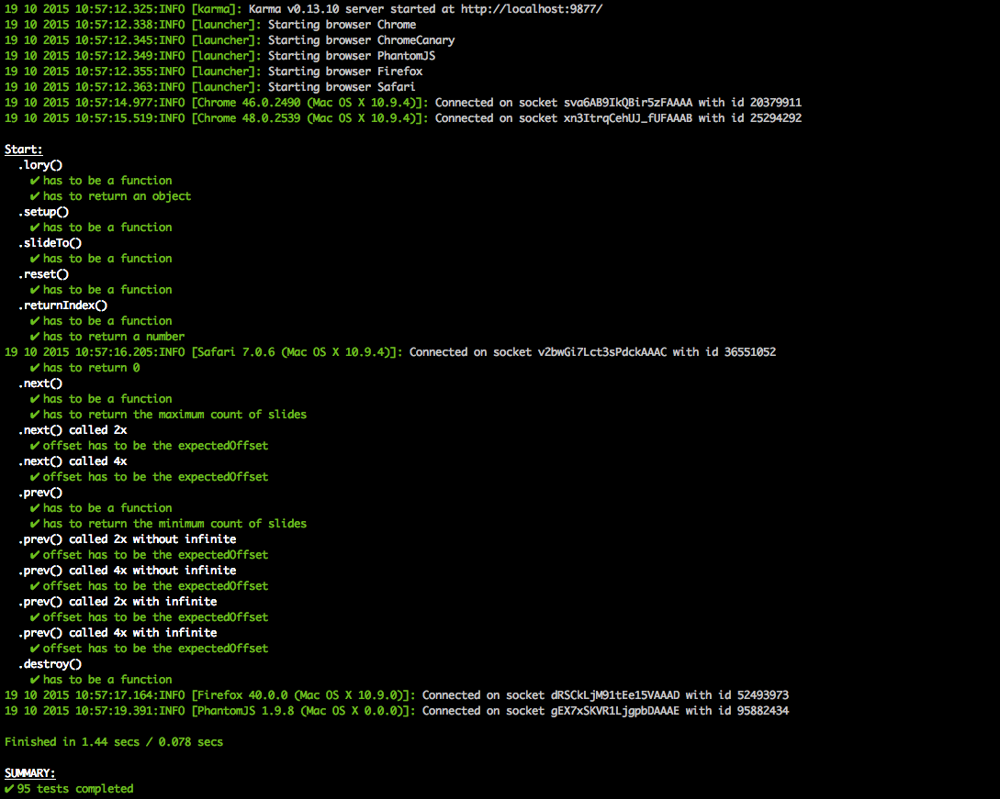

<p align="center">
  
</p>

Please visit: [http://meandmax.github.io/lory/](http://meandmax.github.io/lory/ "lory")

> Touch enabled minimalistic slider written in vanilla JavaScript.

[](https://raw.githubusercontent.com/meandmax/lory/master/LICENSE)
[](https://www.npmjs.com/package/lory.js)

[](https://travis-ci.org/meandmax/lory)
[](https://codeclimate.com/github/meandmax/lory)
[](https://david-dm.org/meandmax/lory#info=devDependencies&view=table)
[](https://github.com/feross/standard)

[](https://gitter.im/meandmax/lory?utm_source=badge&utm_medium=badge&utm_campaign=pr-badge&utm_content=badge)
[](https://github.com/semantic-release/semantic-release)
[](http://commitizen.github.io/cz-cli/)


[](https://saucelabs.com/u/meandmax)

## Download

lory is released under the MIT license & supports modern environments.
There is also a prebundled CDN version which you can use.

####  Vanilla JavaScript: https://cdnjs.cloudflare.com/ajax/libs/lory.js/2.2.0/lory.min.js
#### jQuery plugin: https://cdnjs.cloudflare.com/ajax/libs/lory.js/2.2.0/jquery.lory.min.js

## Install with node:

```
npm install --save lory.js
```

## Consume it as an ES2015 module:

```js
    import {lory} from 'lory.js';

    document.addEventListener('DOMContentLoaded', () => {
        const slider = document.querySelector('.js_slider');

        lory(slider, {
            // options going here
        });
    });
```

## Consume it as an commonJS module:

```js
    var lory = require('lory.js').lory;

    document.addEventListener('DOMContentLoaded', function() {
        var slider = document.querySelector('.js_slider');

        lory(slider, {
            // options going here
        });
    });
```

## Install with bower

```
bower install lory --save
```

## Local development

```
// To install dev dependencies run:

npm install

// To start the development server run:

npm run dev

// To lint your code run:

npm run lint

// To make a full new build run:

npm run build
```

## Run tests

```
// To install dev dependencies run:

npm install

// To start the karma tests locally run:

npm run karma-local
```

<p align="center">
  
</p>

## Prerequisited markup

```html
<div class="slider js_slider">
    <div class="frame js_frame">
        <ul class="slides js_slides">
            <li class="js_slide">1</li>
            <li class="js_slide">2</li>
            <li class="js_slide">3</li>
            <li class="js_slide">4</li>
            <li class="js_slide">5</li>
            <li class="js_slide">6</li>
        </ul>
    </div>
</div>
```

## Prerequisited css

```css
/**
 * (optional) define here the style definitions which should be applied on the slider container
 * e.g. width including further controls like arrows etc.
 */
.slider {}

.frame {
    /**
     * (optional) wrapper width, specifies width of the slider frame.
     */
    width: 880px;

    position: relative;
    font-size: 0;
    line-height: 0;
    overflow: hidden;
    white-space: nowrap;
}

.slides {
    display: inline-block;
}

li {
    position: relative;
    display: inline-block;

    /**
     * (optional) if the content inside the slide element has a defined size.
     */
    width: 880px;
}
```

## Integration

```js
<script src="js/lory.min.js"></script>
<script>
    'use strict';

    document.addEventListener('DOMContentLoaded', function() {
        var slider = document.querySelector('.js_slider');

        lory(slider, {
            // options going here
        });
    });
</script>
```

## Integration as a jQuery Plugin

```js
<script src="dist/jquery.lory.js"></script>
<script>
    'use strict';

    $(function() {
        $('.js_slider').lory({
            infinite: 1
        });
    });
</script>
```

## Integration of multiple sliders on one page

```javascript
<script src="dist/lory.js"></script>
<script>
    'use strict';

    document.addEventListener('DOMContentLoaded', function() {
        Array.prototype.slice.call(document.querySelectorAll('.js_slider')).forEach(function (element, index) {
            lory(element, {});
        });
    });
</script>
```

# Public API

<table>
    <tr>
        <td>prev</td>
        <td>slides to the previous slide</td>
    </tr>
    <tr>
        <td>next</td>
        <td>slides to the next slide</td>
    </tr>
    <tr>
        <td>slideTo</td>
        <td>slides to the index given as an argument: (arguments: index {number})</td>
    </tr>
    <tr>
        <td>returnIndex</td>
        <td>returns the index of the current slide element</td>
    </tr>
    <tr>
        <td>setup</td>
        <td>Binds eventlisteners, merging default and user options, setup the slides based on DOM (called once during initialisation). Call setup if DOM or user options have changed or eventlisteners needs to be rebinded.</td>
    </tr>
    <tr>
        <td>reset</td>
        <td>sets the slider back to the starting position and resets the current index (called on Resize event)</td>
    </tr>
    <tr>
        <td>destroy</td>
        <td>destroys the lory instance by removing all lory specific event listeners</td>
    </tr>
</table>

## Options

<table>
    <tr>
        <td>slidesToScroll</td>
        <td>slides scrolled at once</td>
        <td>default: 1</td>
    </tr>
    <tr>
        <td>infinite</td>
        <td>like carousel, works with multiple slides. (do not combine with rewind)</td>
        <td>default: false (number of visible slides)</td>
    </tr>
    <tr>
        <td>enableMouseEvents</td>
        <td>enabled mouse events</td>
        <td>default: false</td>
    </tr>
    <tr>
        <td>rewind</td>
        <td>if slider reached the last slide, with next click the slider goes back to the startindex. (do not combine with infinite)</td>
        <td>default: false</td>
    </tr>
    <tr>
        <td>slideSpeed</td>
        <td>time in milliseconds for the animation of a valid slide attempt</td>
        <td>default: 300</td>
    </tr>
    <tr>
        <td>rewindSpeed</td>
        <td>time in milliseconds for the animation of the rewind after the last slide</td>
        <td>default: 600</td>
    </tr>
    <tr>
        <td>snapBackSpeed</td>
        <td>time for the snapBack of the slider if the slide attempt was not valid</td>
        <td>default: 200</td>
    </tr>
    <tr>
        <td>ease</td>
        <td>cubic bezier easing functions: http://easings.net/de</td>
        <td>default: 'ease'</td>
    </tr>
    <tr>
        <td>classNameFrame</td>
        <td>class name for slider frame</td>
        <td>default: 'js_frame'</td>
    </tr>
    <tr>
        <td>classNameSlideContainer</td>
        <td>class name for slides container</td>
        <td>default: 'js_slides'</td>
    </tr>
    <tr>
        <td>classNamePrevCtrl</td>
        <td>class name for slider previous control</td>
        <td>default: 'js_prev'</td>
    </tr>
    <tr>
        <td>classNameNextCtrl</td>
        <td>class name for slider next control</td>
        <td>default: 'js_next'</td>
    </tr>
</table>

## Events

<table>
    <tr>
        <td>before.lory.init</td>
        <td>fires before initialisation (first in setup function)</td>
    </tr>
    <tr>
        <td>after.lory.init</td>
        <td>fires after initialisation (end of setup function)</td>
    </tr>
    <tr>
        <td>before.lory.slide</td>
        <td>fires before slide change | <strong>arguments:</strong> currentSlide, nextSlide</td>
    </tr>
    <tr>
        <td>after.lory.slide</td>
        <td>fires after slide change | <strong>arguments:</strong> currentSlide</td>
    </tr>
    <tr>
        <td>on.lory.resize</td>
        <td>fires on every resize event</td>
    </tr>
    <tr>
        <td>on.lory.touchstart</td>
        <td>fires on every slider touchstart event</td>
    </tr>
    <tr>
        <td>on.lory.touchmove</td>
        <td>fires on every slider touchmove event</td>
    </tr>
    <tr>
        <td>on.lory.touchend</td>
        <td>fires on every slider touchend event</td>
    </tr>
    <tr>
        <td>on.lory.destroy</td>
        <td>fires when the slider instance gets destroyed</td>
    </tr>
</table>

## Browser Support

* Chrome
* Safari
* FireFox
* Opera
* Internet Explorer 10+

* Internet Explorer 9 (graceful, without transitions + classlistp)
    - graceful, without transitions
    - you need to polyfill classlist (https://github.com/eligrey/classList.js/)

## Copyright

Copyright &copy; 2015 Maximilian Heinz, contributors. Released under the MIT License
