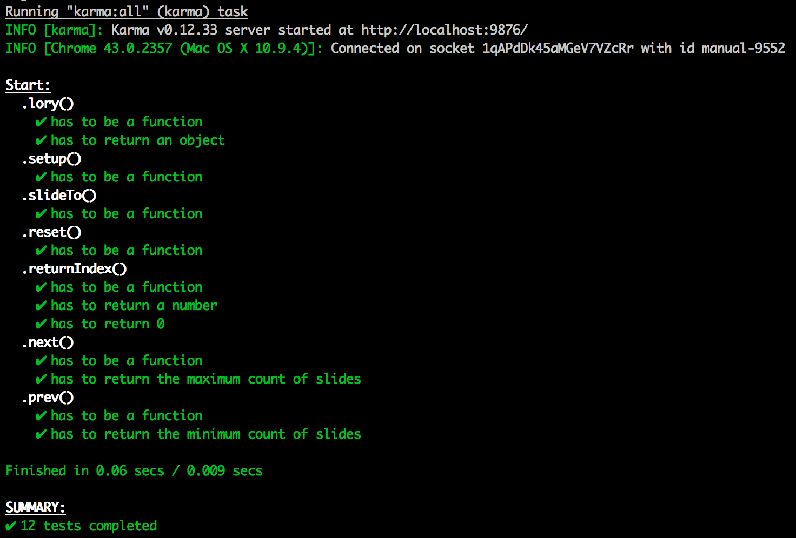

<p align="center">
  
</p>

Please visit: <a href="http://meandmax.github.io/lory/" target="_blank">http://meandmax.github.io/lory/</a>

> Touch enabled minimalistic slider written in vanilla JavaScript.

[](https://raw.githubusercontent.com/meandmax/lory/master/LICENSE)
[](https://www.npmjs.com/package/lory.js)

[](https://travis-ci.org/meandmax/lory)
[](https://codeclimate.com/github/meandmax/lory)
[](https://david-dm.org/meandmax/lory#info=devDependencies&view=table)

[](https://gitter.im/meandmax/lory?utm_source=badge&utm_medium=badge&utm_campaign=pr-badge&utm_content=badge)

## Install with node

```javascript
npm install --save lory.js

var lory = require('lory.js');
```

## Install with bower

```
bower install lory --save
```


## Local development

```
// To install dev dependencies run:

npm install -g grunt-cli
npm install

// To start the development server run:

grunt start

// To lint your code run:

grunt lint

// To make a full new build run:

grunt build
```


## Run tests

```
// To install dev dependencies run:

npm install

// To start karma in chrome browser and run tests:

grunt karma
```

<p align="center">
  
</p>

## Prerequisited markup

```html
<div class="slider js_simple simple">
    <div class="frame js_frame">
        <ul class="slides js_slides">
            <li class="js_slide">1</li>
            <li class="js_slide">2</li>
            <li class="js_slide">3</li>
            <li class="js_slide">4</li>
            <li class="js_slide">5</li>
            <li class="js_slide">6</li>
        </ul>
    </div>
</div>
```

## Prerequisited css

```css
  .frame {
        position: relative;
        font-size: 0;
        line-height: 0;
        overflow: hidden;
        white-space: nowrap;
    }

    .slides {
        display: inline-block;
    }

    li {
        position: relative;
        display: inline-block;

        // example width has to specified for the different views (media queries)
        width: 880px;
    }
```

## Integration

```js
    <script src="js/lory.min.js"></script>
    <script>
        'use strict';

        document.addEventListener('DOMContentLoaded', function() {
            var simple = document.querySelector('.js_simple');

            lory(simple, {
                // options going here
            });
        });
    </script>
```

## Integration as a jQuery Plugin

```js
    <script src="js/jquery.lory.min.js"></script>
    <script>
        'use strict';

        $(function() {
            $('.js_simple').lory({
                infinite: 1
            });
        });
    </script>
```

## Integration of multiple sliders on one page

```javascript
    <script src="js/lory.js"></script>
    <script>
        'use strict';

        document.addEventListener('DOMContentLoaded', function() {
            Array.prototype.slice.call(document.querySelectorAll('.js_slider')).forEach(function (element, index) {
                lory(element, {});
            });
        });
    </script>
```

# Public API

<table>
    <tr>
        <th>prev:</th>
        <td>slides to the previous slide</td>
    </tr>
    <tr>
        <th>next:</th>
        <td>slides to the next slide</td>
    </tr>
    <tr>
        <th>slideTo:</th>
        <td>slides to the index given as an argument: (arguments: index {number})</td>
    </tr>
    <tr>
        <th>returnIndex:</th>
        <td>returns the index of the current slide element</td>
    </tr>
    <tr>
        <th>setup:</th>
        <td>Binds eventlisteners, merging default and user options, setup the slides based on DOM (called once during initialisation). Call setup if DOM or user options have changed or eventlisteners needs to be rebinded.</td>
    </tr>
    <tr>
        <th>reset:</th>
        <td>sets the slider back to the starting position and resets the current index (called on Resize event)</td>
    </tr>
    <tr>
        <th>destroy:</th>
        <td>destroys the lory instance by removing all lory specific event listeners and references to the the DOM elements</td>
    </tr>
</table>

## Options

<table>
    <tr>
        <th>slidesToScroll</th>
        <td>slides scrolled at once</td>
        <td>default: 1</td>
    </tr>
    <tr>
        <th>infinite</th>
        <td>like carousel, works with multiple slides. (do not combine with rewind)</td>
        <td>default: false (number of visible slides)</td>
    </tr>
    <tr>
        <th>rewind</th>
        <td>if slider reached the last slide, with next click the slider goes back to the startindex. (do not combine with infinite)</td>
        <td>default: false</td>
    </tr>
    <tr>
        <th>slideSpeed</th>
        <td>time in milliseconds for the animation of a valid slide attempt</td>
        <td>default: 300</td>
    </tr>
    <tr>
        <th>rewindSpeed</th>
        <td>time in milliseconds for the animation of the rewind after the last slide</td>
        <td>default: 600</td>
    </tr>
    <tr>
        <th>snapBackSpeed</th>
        <td>time for the snapBack of the slider if the slide attempt was not valid</td>
        <td>default: 200</td>
    </tr>
    <tr>
        <th>ease</th>
        <td>cubic bezier easing functions: http://easings.net/de</td>
        <td>default: 'ease'</td>
    </tr>
</table>

## Events

<table>
    <tr>
        <th colspan="2">before.lory.init</th>
        <td>fires before initialisation (first in setup function)</td>
    </tr>
    <tr>
        <th colspan="2">after.lory.init</th>
        <td>fires after initialisation (end of setup function)</td>
    </tr>
    <tr>
        <th>before.lory.slide</th>
        <td><strong>arguments:</strong> currentSlide, nextSlide</td>
        <td>fires before slide change</td>
    </tr>
    <tr>
        <th>after.lory.slide</th>
        <td><strong>arguments:</strong> currentSlide</td>
        <td>fires after slide change</td>
    </tr>
    <tr>
        <th colspan="2">on.lory.resize</th>
        <td>fires on every resize event</td>
    </tr>
    <tr>
        <th colspan="2">on.lory.destroy</th>
        <td>fires when the slider instance gets destroyed</td>
    </tr>
</table>

## Browser Support

* Chrome
* Safari
* FireFox
* Opera
* Internet Explorer 10+
* Internet Explorer 9 (graceful, without transitions)

## Copyright

Copyright &copy; 2015 Maximilian Heinz, contributors. Released under the MIT License
